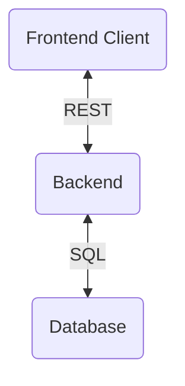
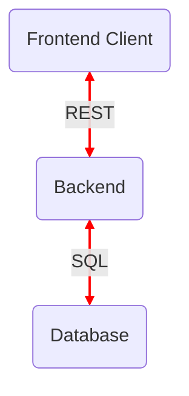
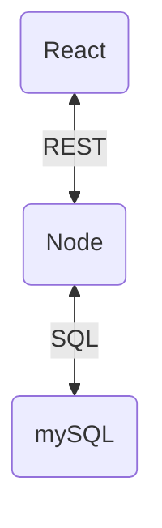
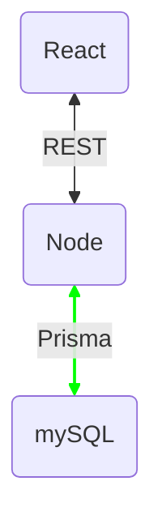
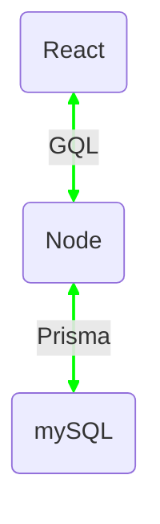
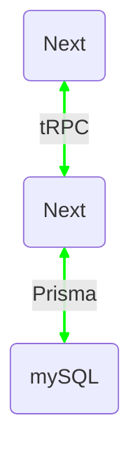

---
# try also 'default' to start simple
theme: geist
colorSchema: 'dark'
# background: https://source.unsplash.com/collection/94734566/1920x1080
# apply any windi css classes to the current slide
# class: 'text-center'
# https://sli.dev/custom/highlighters.html
highlighter: shiki
# show line numbers in code blocks
lineNumbers: false
# some information about the slides, markdown enabled
# info: |
#   ## Slidev Starter Template
#   Presentation slides for developers.

#   Learn more at [Sli.dev](https://sli.dev)
# persist drawings in exports and build
drawings:
  persist: false
---

<br><br><br><br>

# Full-stack typesafety

## <i>Move Fast and Break Nothing</i>
<br><br><br><br><br>
<a href="https://twitter.com/ekaansh" target=_blank>@ekaansh</a>

---
layout: two-cols
---

<div style="display: flex; place-items: center;flex-direction:column"> 

# About me

<br>


### Ekaansh Arora

</div>

::right::

<div style="display: flex; place-items: center;flex-direction:column;margin-top:35%"> 

- Developer Advocate, <a style="color: rgba(221, 221, 221)" href="https://agora.io" target=_blank>Agora​</a>

- JS/TS Nerd

- Maintainer of Agora VideoUIKits

- Maker of 3D art and taylor swift metal covers

<div>

<logos-twitter /> <a href="https://twitter.com/ekaansh" target=_blank>@ekaansh</a>
<span style="margin:10px"></span>
<fa-github /> <a href="https://github.com/ekaansharora" target=_blank>@ekaansharora</a>
</div>

</div>

<!--

# Agenda

<v-clicks>

- How does data flow in your app?
- What is typesafety?
- What we've been using
- What's tRPC?
- What does it look like?
- Demo
- How to get started?
- When to not use?

</v-clicks>
-->
---

# What does full-stack look like?

<div style="margin-left: 20%">


</div>

---

# What is typesafety?
<v-clicks>

#### It's why people like Typescript.
#### The extent to which a programming language discourages or prevents type errors.
#### Compiler red squiggly lines telling you you're makinga a mistake

</v-clicks>

---

# What is fullstack typesafety?

<v-clicks>

#### When you cross a boundary in your stack, do you have access to the previous system's type information?


<div style="margin-left: 20%">


</div>
</v-clicks>

---

# What is fullstack typesafety?


#### When you cross a boundary in your stack, do you have access to the previous system's type information?


<div style="margin-left: 20%">


</div>

---

# What is fullstack typesafety?

#### When you cross a boundary in your stack, do you have access to the previous system's type information?

<div style="margin-left: 20%">


</div>

---


# What is fullstack typesafety?

#### When you cross a boundary in your stack, do you have access to the previous system's type information?


<div style="margin-left: 20%">


<div v-click=1>

</div>
</div>

---


# What is fullstack typesafety?

#### When you cross a boundary in your stack, do you have access to the previous system's type information?


<div style="margin-left: 20%">


<div v-click=0>

</div>
<div v-click=1>

</div>
</div>

---

# What is fullstack typesafety?

#### When you cross a boundary in your stack, do you have access to the previous system's type information?

<div style="margin-left: 20%">


<div v-click=1>

</div>
</div>

---

# What is fullstack typesafety?

#### When you cross a boundary in your stack, do you have access to the previous system's type information?

<div style="margin-left: 20%">


<div v-click=1>

</div>
</div>

---

# What's tRPC?

let's look at some code

---

# What's tRPC?

- Magic glue to communicate between your frontend and backend
- No code generation
- Great autocomplete
- Tiny client side footprint
- Incredilbe DX with TanStack Query, Prisma and Zod


---

# How do I get started?

<br><br>

<v-clicks>

```ts
npx create-t3-app@latest
```

#### TypeScript, Next.js, tRPC, Prisma & NextAuth

simplifies complex boilerplate around the stack


</v-clicks>
---

# Shoutouts
### [Alex](https://twitter.com/alexdotjs), [Sachin](https://twitter.com/s4chinraja) & the team behind [tRPC](https://github.com/trpc/trpc#core-team)
### [Theo](https://twitter.com/t3dotgg) & the team building [create-t3-app](https://github.com/t3-oss/create-t3-app)

---

<div style="display:flex;flex-direction: column; align-items: center">
<br>
<br>
<br>
<br>
<br>
<br>

# Thanks for your time!
<br>

<div>
<logos-twitter /> <a href="https://twitter.com/ekaansh" target=_blank>@ekaansh</a>
</div>

</div>
